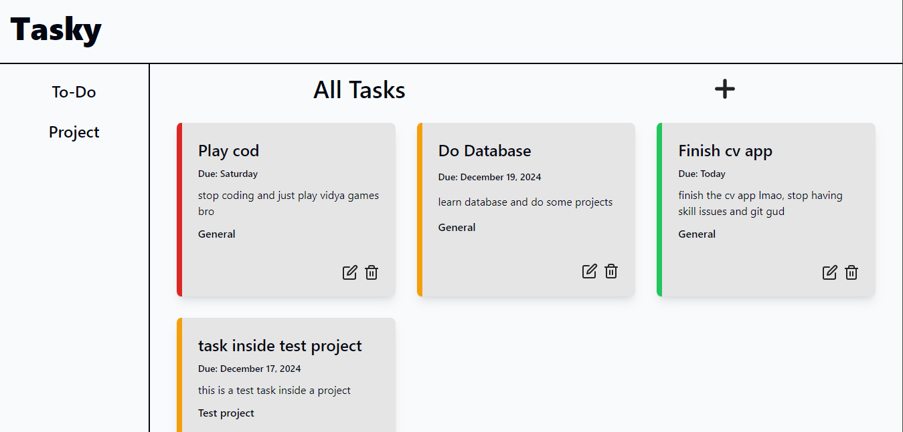
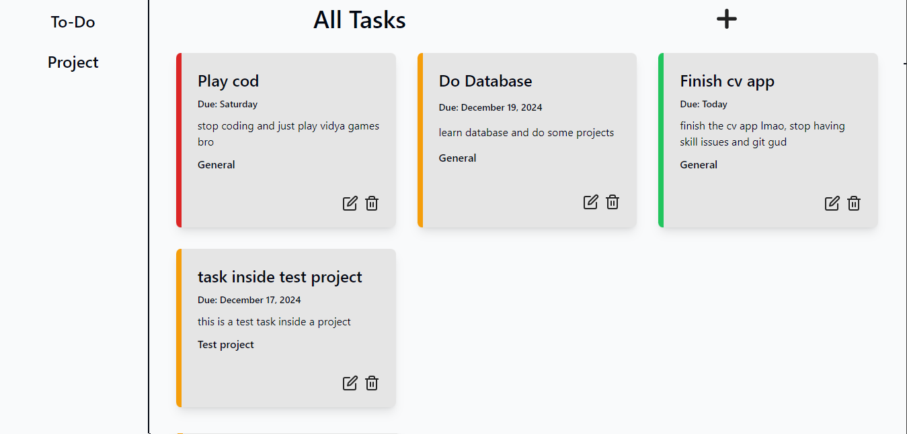
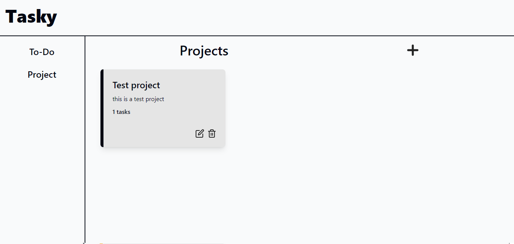
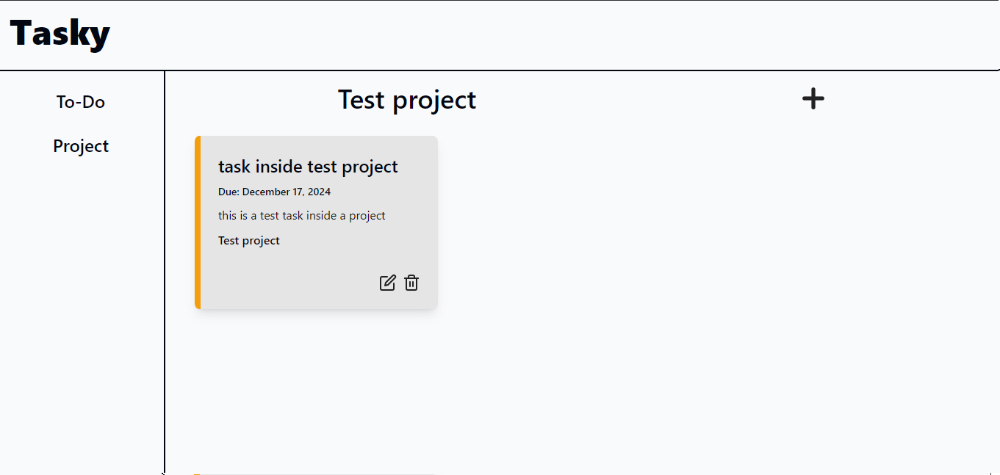

# To-Do List
## Description
A simple to-do list app where the user can add to-dos and projects, edit and delete them.
## How to use
When the page first loaded, this page is displayed



### Navigation and Adding task or project
- The left side is navigation panel
- The upper side is the header, with the logo name
- The right side is the main panel, where the page name, add button, and cards are displayed.
- By default the to-do page is displayed. When Projects is pressed, the project page will be displayed.
- To add a task or project, press the add icon. A modal will pop up asking for details, fill all the input as they are required.

When you pressed the Projects, this image below will be displayed


### Cards
- The task card shows the Task name, due date, task description, what project the task is assigned (by default General), and the control buttons (edit and delete). 
- The color border on the left of the card indicates the priority level: Red - High priority, Amber - Medium priority, Green - Low priority.
- The project card sows the project name, project description, how many task the project has, and control buttons.
- The black border color on the left indicates that it is a project.
- <b>You can click on a project card, which display the tasks it has. Also, you can add more task inside a project</b>
When you click a project card, the image below will be displayed


## Setup and Configuration
Install and configure webpack
```
npm init -y
npm install --save-dev webpack webpack-cli html-webpack-plugin style-loader css-loader html-loader webpack-dev-server

touch webpack.config.js .gitignore
mkdir src
touch src/index.js src/styles.css src/template.html
```
Install and configure tailwind (Use postcss if using webpack)
```
npm install -D tailwindcss postcss postcss-loader
npx tailwindcss init
```
To build tailwind
```
npx tailwindcss -i ./src/input.css -o ./dist/output.css --watch
```

Also, you can read more about them in their docs
<a href="https://tailwindcss.com/docs/installation">Tailwind docs</a>
<a href="https://webpack.js.org/concepts/">Webpack docs</a>

## Icons 
The icons used in this project are from <a href="https://feathericons.com/">Feather Icon</a>

